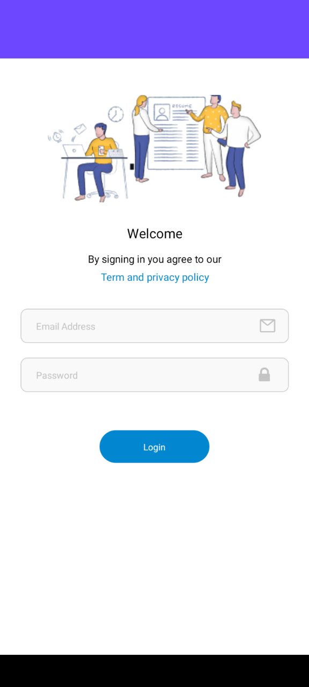
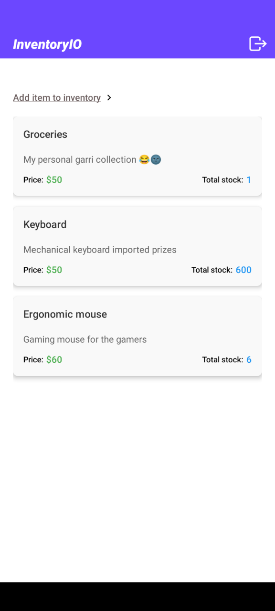
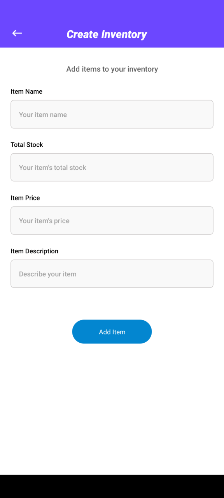
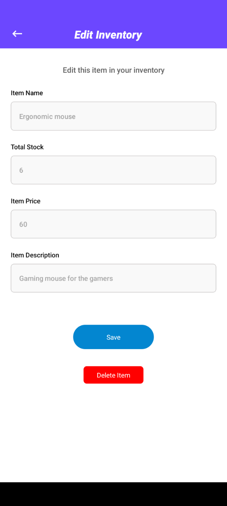
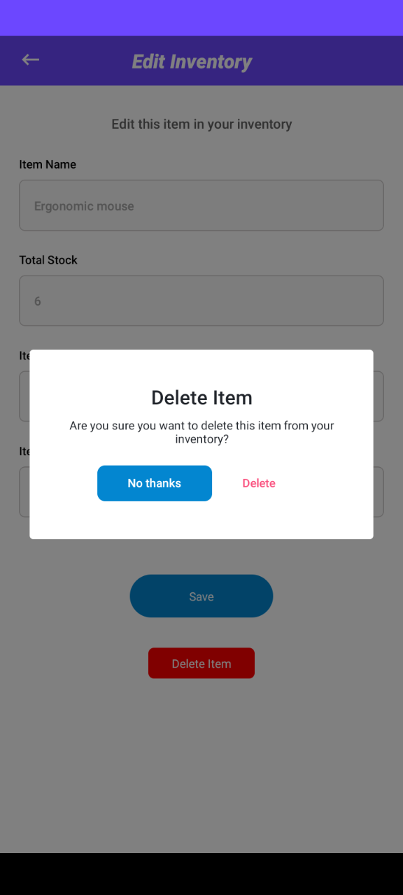

# InventoryIO

Mobile app built with React Native expo and uses Context Api for state management.

InventoryIO is a mobile app that allows users to list, add, edit, and delete inventory items.

## Screenshots

### Login



### Empty home & Home screen with data

&nbsp;&nbsp;&nbsp;&nbsp;&nbsp;&nbsp;&nbsp;&nbsp;

### Create inventory & Edit inventory

&nbsp;&nbsp;&nbsp;&nbsp;&nbsp;&nbsp;&nbsp;&nbsp;

### Modal



## Run locally

To install all dependencies, you need to run the following command:

```bash

git clone https://github.com/the-aydev/InventoryIO.git
cd inventory-io

npm install
npm run start
npx run android

or

npx run ios

```

Write tests that ensure the confirmation pop up is shown when trying to delete an existing items.
Write tests to ensure users are taken to the edit screen after tapping on an existing item in the inventory list.
Write CRUD tests for your async storage operations to ensure Create, Update, Delete, and Get are all called accordingly.
